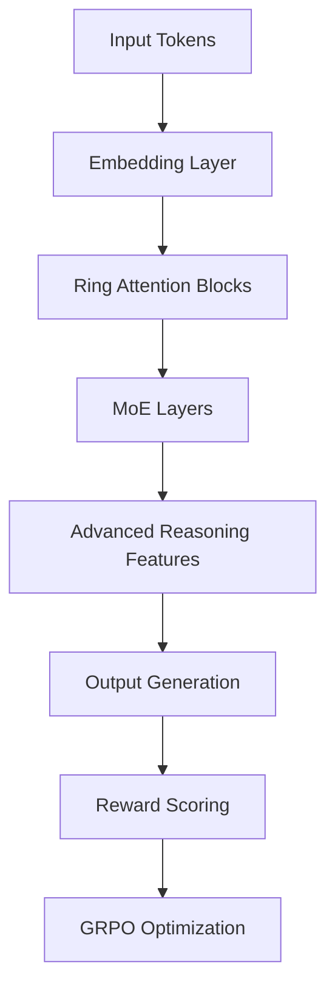

# Better AI: Advanced RLHF System for Coding

## TODO

- [ ] Implement Reinforcement Learning on reasoning trajectories
- [ ] Implement Hybrid attention mechanisms (RoPE + NoPE layers)
- [ ] Implement Query-Key layer normalization
- [ ] Implement Linear attention variants (e.g., DeltaNet, GLA)
- [ ] Implement Gating mechanisms in attention
- [ ] Implement Non-linear reasoning paths
- [ ] Implement Difficulty-based verification rewards
- [ ] Implement Width pruning
- [ ] Add a config option for language choices
- [ ] Add a config option for the number of experts per language

[](https://opensource.org/licenses/MIT)
[](https://www.python.org/)
[](https://pytorch.org/)
[](https://github.com/iamdarshg/better-ai/commits)
[](https://github.com/iamdarshg/better-ai)
[](https://github.com/iamdarshg/better-ai/actions)

**Better AI** is a cutting-edge RLHF (Reinforcement Learning from Human Feedback) system designed for training advanced coding models with superior reasoning, correctness, and alignment capabilities.

## 🚀 Features

- **Multi-Stage Training Pipeline**: Pretraining → SFT → RLHF with GRPO
- **Advanced Architecture**: DeepSeek V3.2 inspired with Ring Attention and MoE
- **Enhanced Reasoning**: Recursive Scratchpad, CoT Specialization, STaR Bootstrapping
- **Multi-Attribute Reward Modeling**: Branch Reward Model (BR-RM) with 4 quality dimensions
- **Memory Optimization**: FP8 quantization, gradient checkpointing, Ring Attention
- **Distributed Training**: DDP/FSDP support for multi-GPU training

## 📋 Table of Contents

- [Installation](#-installation)
- [Quick Start](#-quick-start)
- [Training Pipeline](#-training-pipeline)
- [Architecture Overview](#-architecture-overview)
- [Configuration](#-configuration)
- [Testing](#-testing)
- [GitHub Actions CI/CD](#-github-actions-cicd)
- [Contributing](#-contributing)
- [License](#-license)

## 🛠️ Installation

### Prerequisites

- Python 3.8+
- PyTorch 2.0+
- CUDA 11.8+ (for GPU acceleration)
- 20GB+ GPU memory (recommended)

### Install Dependencies

```bash
git clone https://github.com/iamdarshg/better-ai.git
cd better-ai
pip install -r requirements.txt

# Optional: Install for better performance
pip install flash-attn triton
```

## 🚀 Quick Start

### Run Full Training Pipeline

```bash
# Full pipeline with evaluation (uses mock data for testing)
python train_enhanced.py --stage full --eval --test

# Individual stages
python train_enhanced.py --stage pretrain --test
python train_enhanced.py --stage sft --test
python train_enhanced.py --stage rlhf --test
```

### Python API Example

```python
from better_ai.config import ModelConfig, TrainingConfig
from better_ai.models.enhanced_model import EnhancedDeepSeekModel
from better_ai.training.enhanced_trainer import EnhancedMoETrainer

# Setup configuration
model_config = ModelConfig()
training_config = TrainingConfig(batch_size=2, learning_rate=1e-4, max_steps=100)

# Initialize model and trainer
model = EnhancedDeepSeekModel(model_config)
trainer = EnhancedMoETrainer(model, training_config)

# Train (uses mock data by default)
trainer.train()
```

## 🔄 Training Pipeline

Better AI implements a comprehensive 3-stage training pipeline:

### Stage 1: Pretraining
- **Dataset**: The Stack v2 (billions of code tokens)
- **Objective**: Learn code representations and syntax
- **Duration**: ~1-2 weeks (full scale)

### Stage 2: Supervised Fine-Tuning (SFT)
- **Datasets**: Magicoder + Code-Feedback
- **Objective**: Learn instruction following
- **Data Mix**: 75% Magicoder, 25% Code-Feedback
- **Duration**: ~3-5 days

### Stage 3: RLHF with GRPO
- **Dataset**: CodeUltraFeedback preference pairs
- **Objective**: Align with human preferences
- **Algorithm**: Group Reward Policy Optimization
- **Reward Model**: Branch Reward Model (4 attributes)
- **Duration**: ~5-7 days

## 🏗️ Architecture Overview



### Key Components

1. **Ring Attention**: Enables near-infinite context processing
2. **Mixture of Experts (MoE)**: 16 experts with dynamic routing
3. **Branch Reward Model (BR-RM)**: Multi-attribute quality scoring
4. **GRPO**: Group-based policy optimization
5. **Advanced Reasoning**: Recursive Scratchpad, CoT, STaR, Inner Monologue

## ⚙️ Configuration

### Minimal Configuration (Testing)

```python
from better_ai.config import ModelConfig, TrainingConfig

model_config = ModelConfig(
    vocab_size=32000,
    hidden_dim=512,
    num_layers=4,
    num_experts=4,
)

training_config = TrainingConfig(
    batch_size=2,
    learning_rate=5e-4,
    max_steps=100,
    use_mock_data=True  # Use mock data for testing
)
```

### Production Configuration

```python
model_config = ModelConfig()  # Uses all defaults
training_config = TrainingConfig(
    batch_size=32,
    learning_rate=1e-4,
    max_steps=100000,
    distributed_backend="fsdp",
    use_fp8=True,
)
```

## 🧪 Testing

### Run Unit Tests

```bash
python -m pytest tests/
```

### Test Training Pipeline

```bash
# Test with mock data (fast, no GPU required)
python train_enhanced.py --stage full --test

# Test individual components
python test_model.py
python test_enhanced_model.py
```

## 🤖 GitHub Actions CI/CD

The project includes a comprehensive GitHub Actions workflow that:

1. **Runs on every push to main branch**
2. **Tests the complete training pipeline**
3. **Uses mock data for fast execution**
4. **Validates all training stages**
5. **Checks for crashes or errors**

### Workflow File: `.github/workflows/training_test.yml`

```yaml
name: Training Pipeline Test

on:
  push:
    branches: [ main ]
  pull_request:
    branches: [ main ]

jobs:
  test-training:
    runs-on: ubuntu-latest
    strategy:
      matrix:
        python-version: [3.8, 3.9, 3.10]

    steps:
    - uses: actions/checkout@v4

    - name: Set up Python ${{ matrix.python-version }}
      uses: actions/setup-python@v4
      with:
        python-version: ${{ matrix.python-version }}

    - name: Install dependencies
      run: |
        python -m pip install --upgrade pip
        pip install -r requirements.txt
        pip install pytest

    - name: Test training pipeline with mock data
      run: |
        python train_enhanced.py --stage full --test --batch-size 2 --max-steps 10

    - name: Run unit tests
      run: |
        python -m pytest tests/ -v

    - name: Validate checkpoints
      run: |
        ls -la checkpoints/
        test -f checkpoints/pretrained_model.pt
        test -f checkpoints/sft_model.pt
        test -f checkpoints/rlhf_model.pt
```

### Key Features of the CI/CD Pipeline

- **Multi-Python Version Testing**: Tests on Python 3.8, 3.9, 3.10
- **Fast Execution**: Uses mock data and small batch sizes
- **Memory Efficient**: Small model configuration for CI
- **Comprehensive Validation**: Tests all training stages
- **Checkpoint Verification**: Ensures models are saved correctly

## 📊 Performance Metrics

### Training Metrics

- **Perplexity**: Language modeling quality
- **Loss**: Training and validation loss
- **Accuracy**: Instruction following accuracy
- **Reward Scores**: Multi-attribute quality scores

### Evaluation Metrics

- **Coding Accuracy**: Percentage of correct solutions
- **Reasoning Quality**: Trace coherence and diversity
- **Efficiency**: Time/space complexity scores
- **Alignment**: Correlation with human preferences

## 🔧 Configuration Options

### Training Parameters

| Parameter | Default | Description |
|-----------|---------|-------------|
| `batch_size` | 1 | Batch size per device |
| `learning_rate` | 1e-4 | Initial learning rate |
| `max_steps` | 100000 | Total training steps |
| `use_mock_data` | False | Use mock data for testing |
| `distributed_backend` | "ddp" | "ddp" or "fsdp" |

### Model Parameters

| Parameter | Default | Description |
|-----------|---------|-------------|
| `vocab_size` | 64000 | Vocabulary size |
| `hidden_dim` | 1536 | Hidden dimension |
| `num_layers` | 12 | Number of layers |
| `num_experts` | 16 | Number of MoE experts |

## 🐛 Debugging

### Common Issues

1. **CUDA Out of Memory**
   - Reduce `batch_size`
   - Enable `use_gradient_checkpointing`
   - Use `use_fp8=True`

2. **Slow Training**
   - Enable `use_flash_attention`
   - Use mixed precision (`bf16=True`)
   - Increase `gradient_accumulation_steps`

3. **Training Instability**
   - Reduce `learning_rate`
   - Increase `warmup_steps`
   - Enable gradient clipping

### Debug Commands

```bash
# Enable debug logging
export LOG_LEVEL=DEBUG
python train_enhanced.py --stage pretrain --test

# Profile memory usage
python -m memory_profiler train_enhanced.py --stage pretrain --test

# Profile time
python -m cProfile -s time train_enhanced.py --stage pretrain --test
```

## 📚 Documentation

- **[ARCHITECTURE.md](ARCHITECTURE.md)**: Detailed architecture documentation
- **[QUICKSTART.md](QUICKSTART.md)**: Quick start guide with examples
- **API Documentation**: Comprehensive docstrings in all modules
- **Examples**: Runnable examples in the `examples/` directory

## 🤝 Contributing

We welcome contributions! Please follow these steps:

1. Fork the repository
2. Create a feature branch: `git checkout -b feature/your-feature`
3. Commit your changes: `git commit -am 'Add some feature'`
4. Push to the branch: `git push origin feature/your-feature`
5. Create a pull request

### Development Setup

```bash
git clone https://github.com/iamdarshg/better-ai.git
cd better-ai
pip install -e .  # Install in development mode
pip install -r requirements-dev.txt
```

### Code Style

- Follow PEP 8 guidelines
- Use type hints
- Write comprehensive docstrings
- Include unit tests for new features

## 📜 License

This project is licensed under the **MIT License** - see the [LICENSE](LICENSE) file for details.

## 🙏 Acknowledgments

- DeepSeek team for the original architecture
- Hugging Face for transformers library
- PyTorch team for the deep learning framework
- All contributors and users of Better AI

## 📬 Contact

For questions, issues, or contributions:
- **GitHub Issues**: https://github.com/iamdarshg/better-ai/issues
- **Discussions**: https://github.com/iamdarshg/better-ai/discussions
- **Email**: darshgupta@example.com

---

**Happy Training! 🚀**
